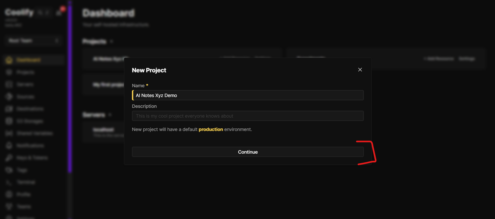

# Step 1 — Create or open a Coolify project

Open Coolify in your browser.

If you already have a project, open it. If not, create a new project and give it a simple name, like `ai-notes`.

A project is just a folder in Coolify. It holds the apps you will add next.

**Next:** [Step 2 — Add the app from Git and deploy](/docs/selfhost/coolify-cloud/coolify-cloud-step-02-add-app-from-git-and-deploy)
