# Step 3 — Add the workspace app from Git and deploy

This step is optional. Skip it if you only want notes, tasks, and chat.

The workspace is a **second Coolify app**. It is not the main website. It gives you the agent desktop and the workspace API.

Follow the screens in order.

## Table of contents

1. [Add a resource](#add-a-resource)
2. [Pick Public Repository](#pick-public-repository)
3. [Enter the workspace repo URL](#enter-the-workspace-repo-url)
4. [Use Dockerfile and continue](#use-dockerfile-and-continue)
5. [Set the name, domains, and ports](#set-the-name-domains-and-ports)
6. [Set API_TOKEN, PASSWORD, and OPENCODE_SERVER_PASSWORD](#set-api_token-password-and-opencode_server_password)
7. [Add disk at /config](#add-disk-at-config)
8. [Add DNS records](#add-dns-records)
9. [Check domains](#check-domains)
10. [Deploy and wait](#deploy-and-wait)
11. [Connect Settings](#connect-settings)

## 3.1 Add a resource {#add-a-resource}

Stay in the same Coolify project you used for the main app.

Click **+ New**.

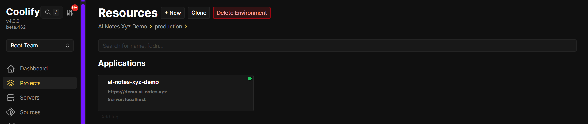

## 3.2 Pick Public Repository {#pick-public-repository}

Under **Git Based**, click **Public Repository**.

Coolify will clone the workspace from GitHub and build it.

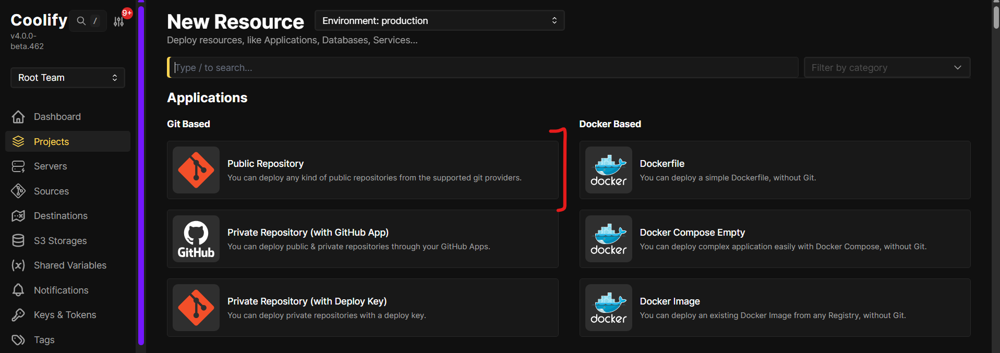

## 3.3 Enter the workspace repo URL {#enter-the-workspace-repo-url}

Set the repository URL to:

`https://github.com/thenbthoughts/ai-notes-xyz-agent-workspace`

Click **Check repository**.

Leave **Branch** as `main`.

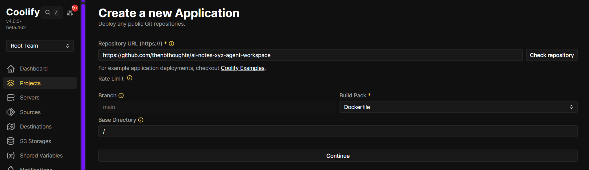

## 3.4 Use Dockerfile and continue {#use-dockerfile-and-continue}

Set **Build Pack** to **Dockerfile**. Leave **Base Directory** as `/`.

Do not set a custom start command. The image already starts the desktop and the workspace API.

Click **Continue**.

The first build can take 10 to 20 minutes. The image is large (desktop, browser, and tools).


## 3.5 Set the name, domains, and ports {#set-the-name-domains-and-ports}

On **General**, set a name (for example `ai-notes-xyz-agent-workspace-demo`).

Leave **Build Pack** as **Dockerfile**.

Set **Domains** to two public URLs, with the container port after each one:

```text
https://workspace.example.com:3000,https://workspace-api.example.com:2001
```

| URL | Port | What it is |
| --- | --- | --- |
| `https://workspace.example.com:3000` | 3000 | Desktop in the browser |
| `https://workspace-api.example.com:2001` | 2001 | Workspace API |

The `:3000` and `:2001` tell Coolify which port inside the container to use. People usually open the site on normal HTTPS (port 443). You do not type `:3000` in the browser if Coolify is proxying for you.

Use two hostnames (one for the desktop, one for the API). That matches the Settings form later.

Do not put port **3001** on the public proxy. That port is a self-signed HTTPS desktop. Coolify already handles HTTPS.

Click **Save**.

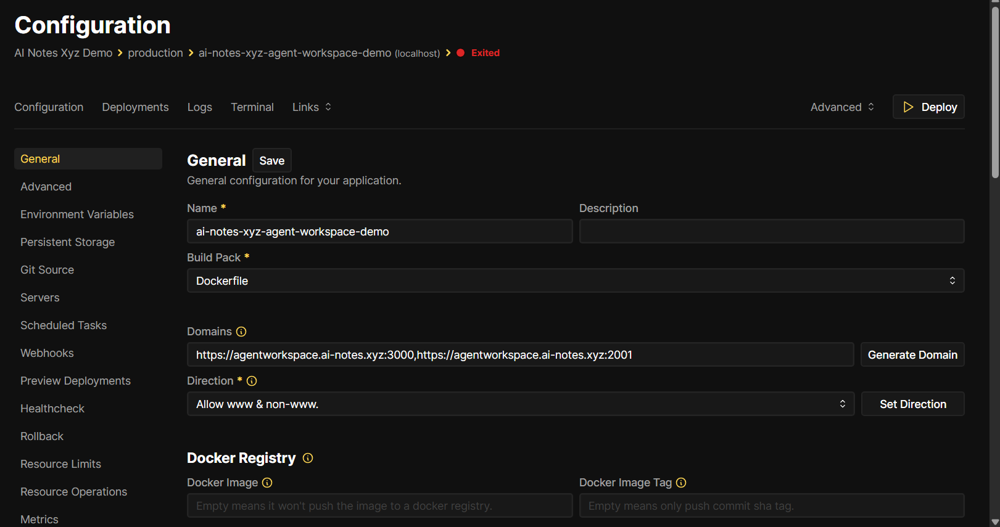

## 3.6 Set API_TOKEN, PASSWORD, and OPENCODE_SERVER_PASSWORD {#set-api_token-password-and-opencode_server_password}

Open **Environment Variables**. Click **+ Add**.

Add these three. Mark them as secret. Keep **Available at Buildtime** and **Available at Runtime** checked.

| Name | What it is |
| --- | --- |
| `API_TOKEN` | A long random string. The main app sends this as `X-API-Token`. If it is empty, protected routes fail. |
| `PASSWORD` | Login password for the desktop. Do **not** use the default `agentworkspace` on the public internet. |
| `OPENCODE_SERVER_PASSWORD` | Password for OpenCode inside the workspace (the agent code runner). Do not use the default `password` on the public internet. |

The desktop login name is `CUSTOM_USER`. If you do not set it, it is `abc`.

Pick strong passwords. Anyone who can open the desktop can run commands in that container.

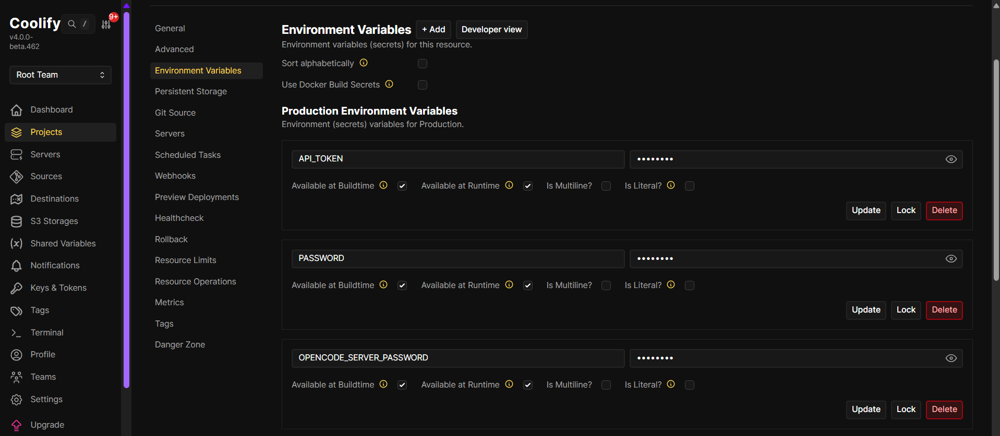

## 3.7 Add disk at /config {#add-disk-at-config}

Open **Persistent Storage**.

If you see **No storage found**, click **+ Add**, then **Directory Mount**.

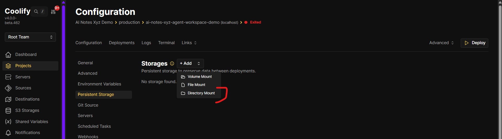

In **Add Directory Mount**:

- **Source Directory** — a folder on the Coolify server, for example `/home/YOUR_USER/workspace-config`
- **Destination Directory** — `/config`

Click **Add**.

This folder keeps the desktop home and agent files. If you skip this, files can disappear when you redeploy.

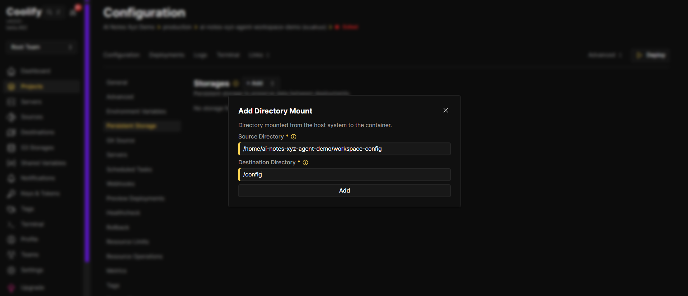

## 3.8 Add DNS records {#add-dns-records}

At your DNS host, add two **A** records. Point both at your Coolify server IP.

| Host | Points to |
| --- | --- |
| `workspace` | your server IP |
| `workspace-api` | your server IP |

Use the hostnames that match the domains you set in Coolify. Wait for DNS to update before you expect HTTPS to work.

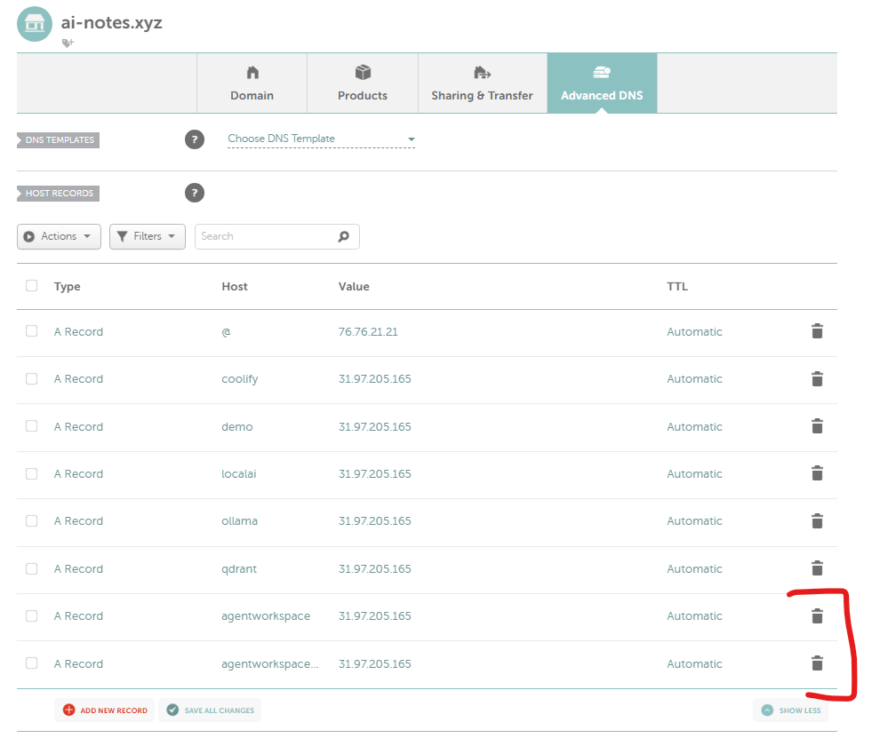

## 3.9 Check domains {#check-domains}

Go back to **General**. Confirm **Domains** still has both URLs, with `:3000` on the desktop host and `:2001` on the API host.

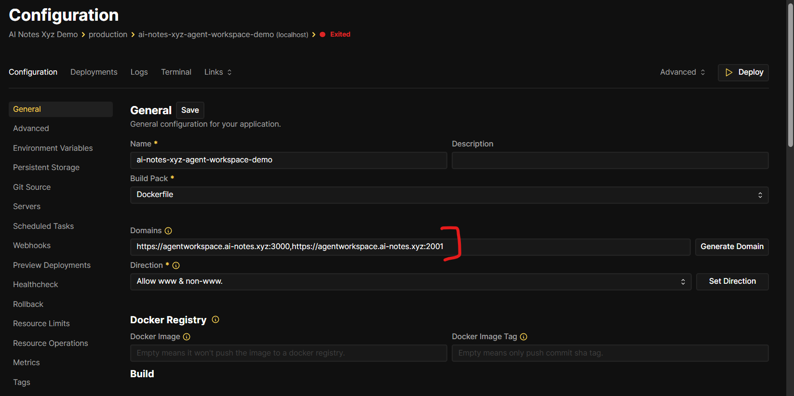

## 3.10 Deploy and wait {#deploy-and-wait}

Click **Deploy**.

The first build is slow. Wait until the log finishes.

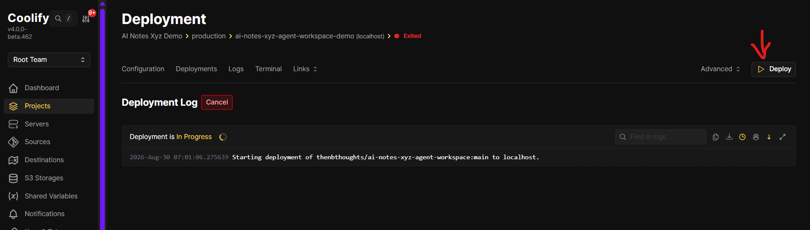

When it is done, **Deployments** should show **Success**, and the app should say **Running**.

Check:

1. Open the API URL at `/api/`. You should see a welcome text.
2. Open the desktop URL. Log in with `CUSTOM_USER` (default `abc`) and your `PASSWORD`.

The desktop uses a live connection (WebSockets). If the page loads but the screen stays black, check that WebSockets are not blocked.

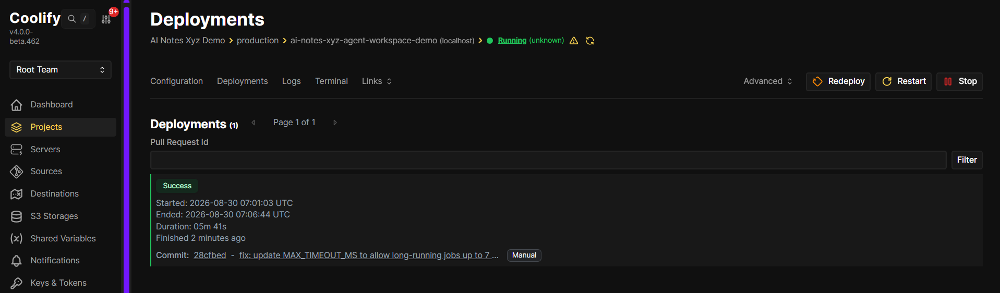

## 3.11 Connect Settings {#connect-settings}

Open the main AI Notes app. Go to **Settings → API keys**. Click **Agent Workspace**.

Paste:

- **Desktop URL** — the desktop origin, like `https://workspace.example.com` (no path)
- **Desktop Basic Auth Username** — `CUSTOM_USER` (default `abc`)
- **Desktop Basic Auth Password** — the same `PASSWORD` you set in Coolify
- **Agent Workspace API URL** — the API origin only, like `https://workspace-api.example.com` (no `/api` at the end)
- **API token** — the same `API_TOKEN` you set in Coolify

Click **Verify and save**. A green **Valid** badge means it worked.

You are done.

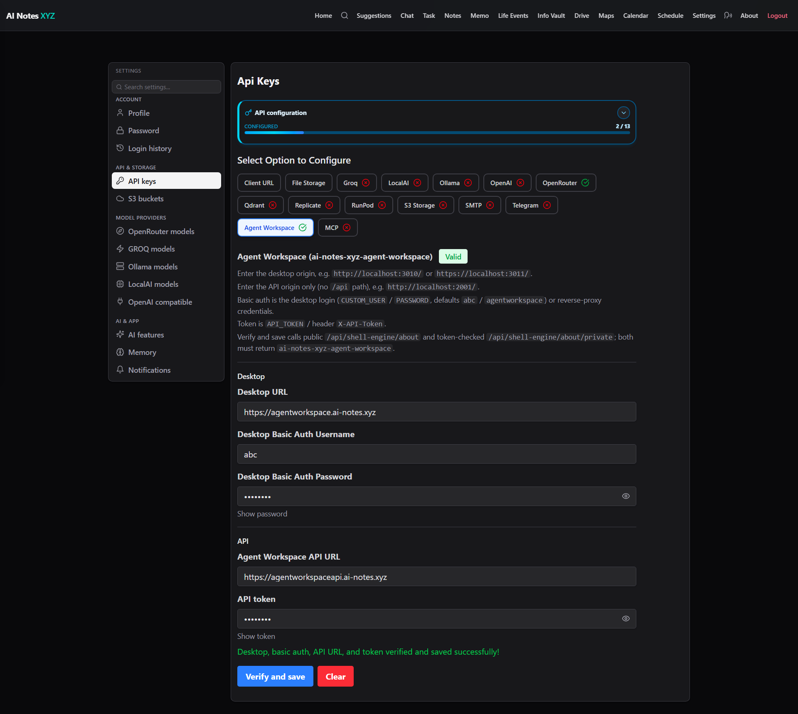

